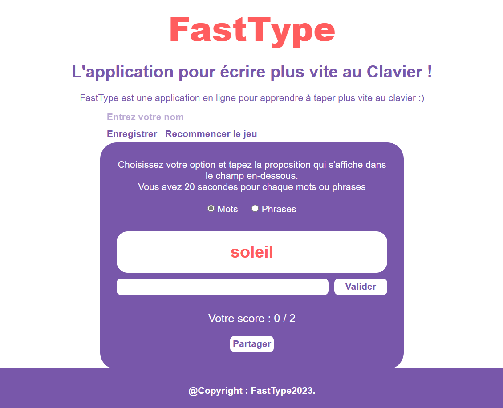

# FastType  
- Jeu de Dactylographie

FastType est un jeu de dactylographie amusant et éducatif conçu pour améliorer vos compétences en frappe au clavier. Le jeu propose une série de mots et de phrases de plus en plus difficiles que vous devez taper aussi rapidement et avec le moins d'erreurs possible. Défiez-vous et vos amis pour obtenir les meilleurs scores !

## Fonctionnalités

- Choisissez entre deux modes de jeu : "Mots" ou "Phrases".
- Testez votre vitesse et votre précision de frappe.
- Enregistrez vos meilleurs scores et suivez votre progression.
- Partagez vos résultats avec vos amis par e-mail.
- Personnalisez votre nom pour personnaliser votre expérience.

## Comment jouer

1. Sélectionnez le mode de jeu "Mots" ou "Phrases".
2. Tapez le mot ou la phrase qui s'affiche dans la zone de saisie.
3. Appuyez sur le bouton "Valider" après chaque saisie.
4. Votre score s'actualisera en temps réel.
5. Répétez jusqu'à la fin du jeu ou jusqu'à ce que le temps s'écoule.

## Installation

1. Clonez ce dépôt GitHub sur votre machine locale.
2. Ouvrez le fichier `index.html` dans votre navigateur web.

## Captures d'écran

## Contribuer

Nous sommes ouverts aux contributions. Si vous souhaitez améliorer le jeu, ajouter des fonctionnalités ou corriger des bugs, n'hésitez pas à soumettre une demande d'extraction (pull request).

---

Amusez-vous bien en jouant à FastType ! Testez vos compétences en dactylographie et atteignez le sommet du classement.
